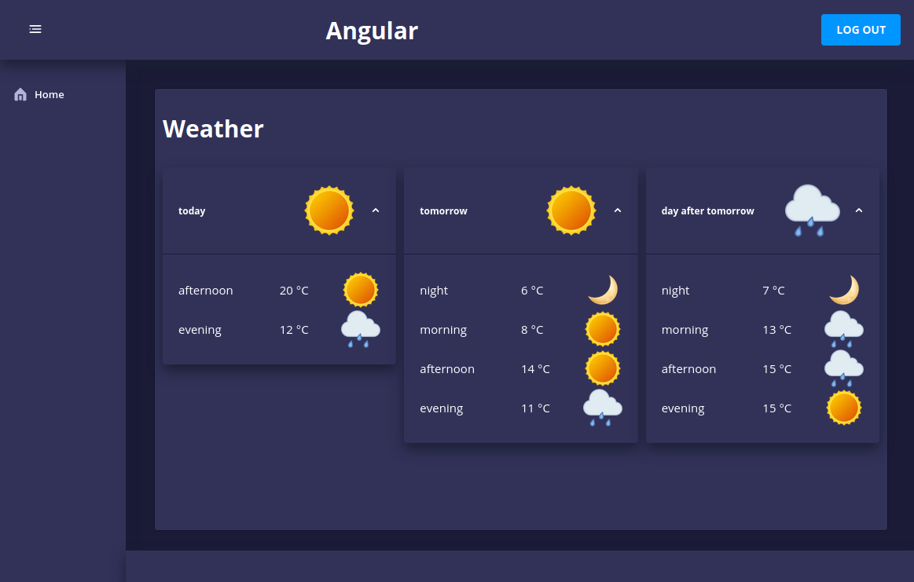

# **Prepared Angular template with Nebular, ESLint and Prettier**

This repo is my go-to template when I want to create an Angular application. This template includes [Nebular](https://github.com/akveo/nebular) UI elements, [ESLint](https://github.com/eslint/eslint) and [Prettier](https://github.com/prettier/prettier).

## Prerequisites

In order to run Angular, you will need to install Node.js which also installs the [npm package manager](https://www.npmjs.com/get-npm). Check the Node version by typing `node -v` and make sure it is above 10.13 because we want to use Angular 11. Ubuntu is an example of a distro which does not offer the latest version of Node in the regular repos. Look at this [askubuntu](https://askubuntu.com/questions/1259840/why-an-old-nodejs-version-is-installed-on-my-ubuntu-machine) thread to find out how to get a newer version manually. After that, you can install the [Angular CLI](https://angular.io/guide/setup-local). If you want to serve the application through Docker, install [Docker](https://docs.docker.com/engine/install/) and [Docker-Compose](https://docs.docker.com/compose/install/) as well.

## Installation

Clone this repo, navigate to the cloned repo folder and type `npm install` or `npm i`. To take it out for a spin, type `ng serve` and hit the browser on http://localhost:4200. Use `ng serve --host IPADDRESS` to make the application reachable from other devices on the same local network. If you want to run the application through https, create the appropriate .key and .crt files and specify their locations in the `npm start` script in package.json.

## TypeError: this.\_document is undefined or TypeError: Cannot read property 'defaultView' of undefined

Running Angular 11 together with Nebular may give you an empty (white) website after starting the application. There is a missing 'document' parameter in the constructor of NbViewportRulerAdapter as stated [here](https://github.com/akveo/nebular/issues/2572#issuecomment-731615605). This repo includes the patches and should work straight out of the box. If not, you can run `npm run patch-fix` after applying the changes from the link.

## Unit tests

Unit tests are included and use Angular's default test framework [Jasmine](https://jasmine.github.io/) with [Karma test runner](https://karma-runner.github.io/latest/index.html). Run tests by typing `ng test`.

## End-to-end tests

End-to-end tests are executed by `ng e2e` using [Protractor](http://www.protractortest.org/).

## Runtime

The Angular application is meant to be deployed through Nginx inside a Docker container by the command `npm run docker`. This is a script located in package.json and it will build a Docker image, remove dangling images and launch the application in a Docker container by Docker-Compose. Both the Docker image and container will be named 'angular-temp' unless changed in package.json.

## GitLab CI/CD

This repo includes a GitLab CI/CD configuration file which uses the Docker image found in the 'docker-ci' folder. This Docker image includes the chromedriver to run headless during GitLab CI tests. To create the image, type `npm run docker-ci` from the root project folder. The name of the Docker image may be changed in the 'scripts' section in package.json and needs to be matched up with the name in the .gitlab-ci.yml file. I run my own [GitLab](https://gitlab.com/gitlab-org/gitlab) server locally and use [GitLab Runners](https://docs.gitlab.com/runner/) for CI/CD operations.

## Using Prettier in VS Code

Prettier is a code formatter where you can define formatting rules and apply them with a simple file save. I use it all the time to clean up messy code. To activate in VS Code, go to File -> Preferences -> Settings and search for Format On Save and check the box. You might also need to search for Default Formatter and choose Prettier as the formatter.

## Serve through Docker and Nginx

The application is prepared to be served in a Docker container through [Nginx](https://www.nginx.com/). It defaults to http (port 80) but can easily be configured for https. You will need to provide a certificate(.crt), certificate key(.key) and a Diffie-Hellman parameter key(dhparam.pem) in 'nginx.conf'. I like to use [OpenSSL](https://www.openssl.org/docs/man1.0.2/man1/dhparam.html) to create the certificates. To serve through Docker, type `npm run docker`. This is a script which builds and creates a running Docker container with Docker-Compose. The application will then be available on port 80 and accessible at http://IPADDRESS on the local network. See the details of how it is done in the 'scripts' section of package.json.

## Nebular theme

The chosen theme is Cosmic but you can [change theme](https://akveo.github.io/nebular/docs/design-system/changing-theme#change-current-theme) if you like.
